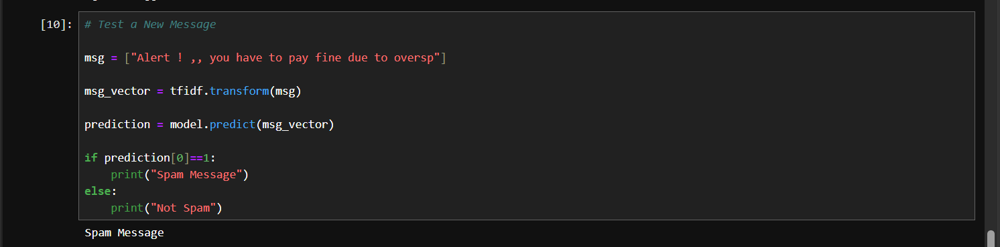
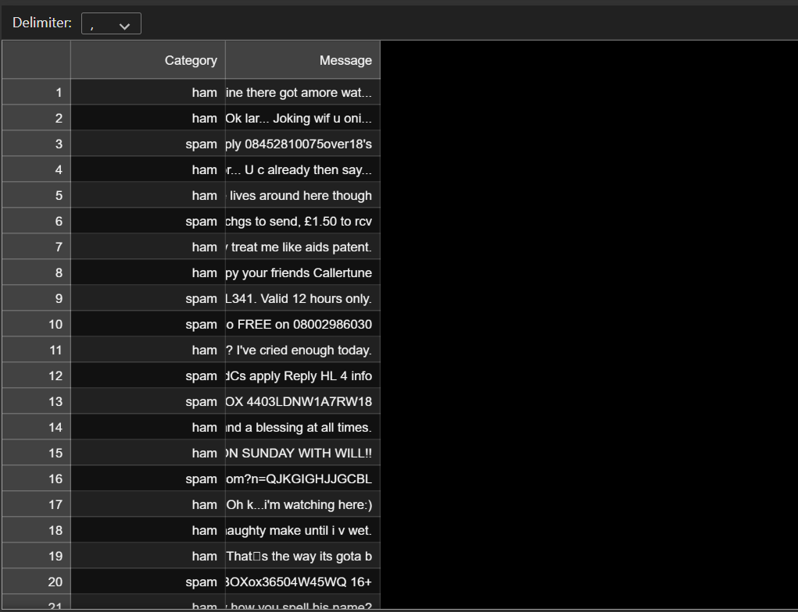
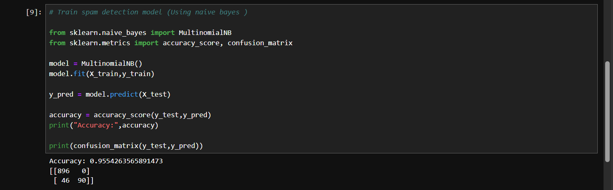

# Email Spam Detection

## Overview
This project detects whether an email/message is Spam or Ham using Machine Learning and NLP techniques.

## Technologies Used
- Python
- Pandas
- NumPy
- Scikit-learn
- NLP

## Features
- Text preprocessing
- Spam classification
- Model training and testing
- Accuracy evaluation

## Dataset
Spam email dataset containing labeled spam and ham messages.

## Output Screenshots

### Prediction Output

### Dataset Preview

### Accuracy

## Author
Somendra Tailor
